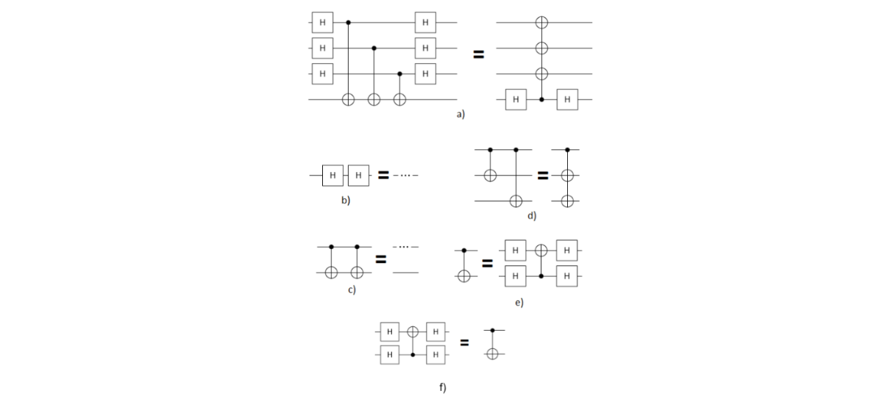

# Optimizing quantum circuits using Transformers in Cirq

#### This project was done as a part of Aalto University's course Practical Quantum Computing in spring/summer 2023. The problem description is the following:

Quantum circuit optimisation using template-based rewrite rules is widely used in quantum circuit software (e.g. Google Cirq, IBM Qiskit). An input circuit is gradually transformed by applying quantum gate identities until a given optimization criterion is met. The gate set and the size of the input circuits influence the performance of the procedure. The number of permitted transformations blows up the size of the optimisation search space. Consequently, although this kind of optimisation performs well, it is challenging to improve its scaling.
The goal of this project is to implement a set of functionalities (which we will call transformers) that apply a given set of template-based rewrite rules to randomly generated quantum circuits in all locations of the circuit that permit it. There should be six circuit transformers in total, one for each of the following circuit identities:

Note that the templates above are invariant to qubit permutations or orderings. For example, transformers should be effective for these cases also:

**Goals**:
<ol type="A">
    <li>Read the Transformer documentation and try to implement the given circuit identities.</li>
    <li>Generate random quantum circuits that include the mentioned identities to test your implementation. Hint: manually insert gates on randomly chosen qubits to construct templates.</li>
    <li>For each transformer class, write a functionality that tests the correctness of your transformer implementation.</li>
</ol>

**Criteria for Grading**:
<ol>
    <li>Pass: A, B</li>
    <li>Full points: C</li>
</ol>

# Installation

<ol>
    <li>Make sure you have Python 3 installed and you are using an IDE that has Jupyter Notebook integration (author used VSCode).</li>
    <li>Clone the repository to your computer.</li>
    <li>Navigate to the root of the directory using command prompt and run install_venv.sh. This activates a virtual environment and installs all the needed dependencies.</li>
    <li>If you want to use Jupyter Notebooks you need to select the virtual environment (named venv) as your kernel. In VSCode press ctrl + shift + p and select "Jupyter: Select Interpreter to Start Jupter Server" and choose venv. Next you can open a Jupter Notebook and in the top right corner click "Select Kernel" and choose venv. If you are using some other IDE Google is your friend.</li>