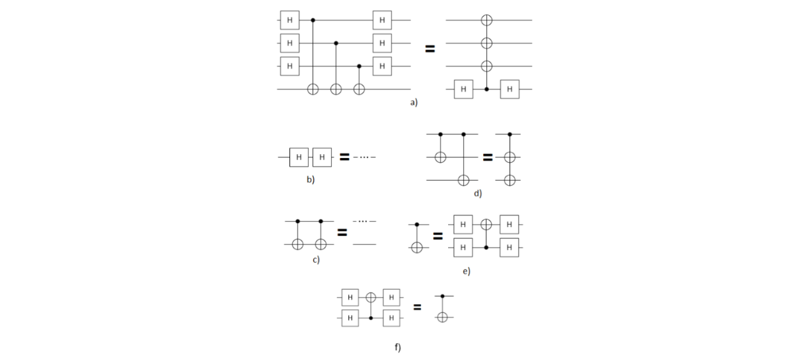

# Optimizing quantum circuits using Transformers in Cirq

#### This project was done as a part of Aalto University's course called Practical Quantum Computing during spring/summer of 2023. The problem description is the following:

Quantum circuit optimisation using template-based rewrite rules is widely used in quantum circuit software (e.g. Google Cirq, IBM Qiskit). An input circuit is gradually transformed by applying quantum gate identities until a given optimization criterion is met. The gate set and the size of the input circuits influence the performance of the procedure. The number of permitted transformations blows up the size of the optimisation search space. Consequently, although this kind of optimisation performs well, it is challenging to improve its scaling.
The goal of this project is to implement a set of functionalities (which we will call transformers) that apply a given set of template-based rewrite rules to randomly generated quantum circuits in all locations of the circuit that permit it. There should be six circuit transformers in total, one for each of the following circuit identities:

Note that the templates above are invariant to qubit permutations or orderings. For example, transformers should be effective for these cases also:

**Goals**:
<ol type="A">
    <li>Read the Transformer documentation and try to implement the given circuit identities.</li>
    <li>Generate random quantum circuits that include the mentioned identities to test your implementation. Hint: manually insert gates on randomly chosen qubits to construct templates.</li>
    <li>For each transformer class, write a functionality that tests the correctness of your transformer implementation.</li>
</ol>

**Criteria for Grading**:
<ol>
    <li>Pass: A, B</li>
    <li>Full points: C</li>
</ol>

# Documentation

### Generating random circuits

src/random_circuit_generator.py includes a function called create_random_circuit which takes as input the number of qubits (n_qubits) and the number of random templates added to the circuit (n_templates). The templates are the circuits on the left hand side of the circuit identities in the problem statement. The function creates a Cirq circuit with the specified number of qubits and for the specified number of times it selects one of the templates at random and appends it to the end of the circuit. The qubits that are acted on in each new template are chosen randomly. Also the number of CNOT-gates in template a and d are randomly chosen.

### Transformers

The transformers are implemented as functions in src/transformers/transformers.py. Link to the Cirq transformer documentation: https://quantumai.google/cirq/transform/custom_transformers

### Optimizer

src/optimizer.py includes a function called optimize which optimizes Cirq circuits. It creates multiple optimized circuits and outputs the best one (shortest). For each optimized circuit it randomly selects transformers with specified probability distributions and applies them on the circuit being optimized. The probability distribution for choosing the initial transformer is specified by initial_probs and after that the probability distributions are specified by a two dimensional array called transition_probs. It contains a row for each previously applied transformer containing the probability distribution for choosing the next one.   

### Results

See src/notebooks/results_notebook.ipynb

### Tests

For each transformer function there is a test class which currently includes three tests. The first test creates a circuit and adds the left hand side of the identity that the transformer being tested implements. It then applies the transfomer to that circuit and checks if it outputs the correct circuit. The second test does the same but it adds the left hand side of the identity multiple times on random qubits. The third test creates a random circuit and applies to it the transformer that is being tested. It then checks if the effect of the outputted circuit and the original circuits have equivalent effects using Cirq's function assert_circuits_with_terminal_measurements_are_equivalent.

All test can be run by navigating to the root of the directory using command prompt and running "python -m unittest".

# Installation

<ol>
    <li>Make sure you have Python 3 installed and you are using an IDE that has Jupyter Notebook integration (author used VSCode).</li>
    <li>Clone the repository to your computer.</li>
    <li>Navigate to the root of the directory using command prompt and run install_venv.sh. This activates a virtual environment and installs all the needed dependencies.</li>
    <li>If you want to use Jupyter Notebooks you need to select the virtual environment (named venv) as your kernel. If you are using VSCode, press ctrl + shift + p and select "Jupyter: Select Interpreter to Start Jupter Server" and choose venv. Next you can open a Jupter Notebook and in the top right corner click "Select Kernel" and choose venv. If you are using some other IDE Google is your friend.</li>